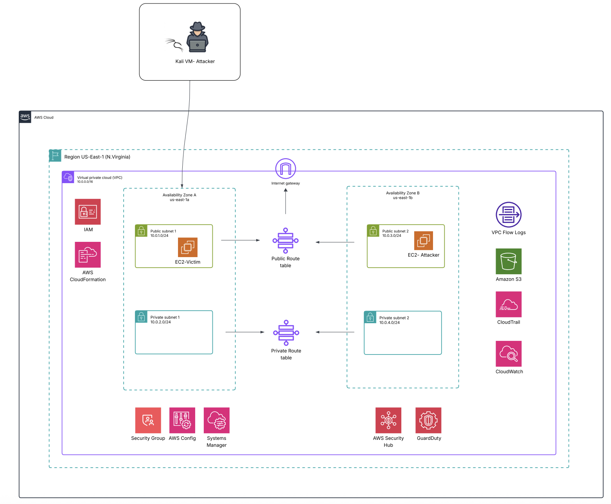

# 🚀 Cloud Security Training Environment in AWS

### Goal: Architecting a Compliance-Driven Cyber Range

**My Role:** Network & Security Lead (The Compliance Collective Team)

---

## 💡 The Challenge
The team was tasked with building a fully segmented, repeatable **Cloud Security Training Environment** within AWS. The core challenge was designing the network architecture to securely support both Red Team activities (via Kali/EC2) and Blue Team detection/remediation, all while strictly adhering to **Governance, Risk, and Compliance (GRC)** principles.

## 🛠️ Process & My Technical Contributions

As the **Network & Security Lead**, I was fundamentally responsible for designing and troubleshooting the secure networking layer.

### 1. Secure VPC Architecture & Segmentation
* **CIDR Plan:** Defined the CIDR plan and logically segmented the environment into **two public and two private subnets** across multiple Availability Zones to ensure high availability and isolation.
* **Key Networking Components:** Configured all critical networking components, including the Internet Gateway, **NAT Gateways** (for private subnet outbound access), and complex **Route Tables** to control traffic flow between all VPC components.
* **Troubleshooting:** Successfully resolved initial networking dependencies (IGW resource IDs, duplicate routes) to ensure a stable, resilient foundation for the entire training environment.

**Figure 1:** Network Topology Diagram of the AWS Cyber Range showing the segmented VPC, public/private subnets, and key AWS services (e.g., CloudTrail, GuardDuty) for compliance and monitoring.

### 2. GRC-Focused Monitoring Implementation
* **Threat Detection:** Integrated native AWS services, including **GuardDuty** and **CloudTrail**, to monitor for common threats (Port Scans, S3 Exfiltration) within the environment.
* **Compliance Baseline:** The stable, segmented network enabled the Blue Team to establish monitoring protocols that directly reinforced **GRC compliance** and best practices for cloud infrastructure.

## ✅ Outcome & Impact
We delivered a robust, production-ready cloud network design that served as the secure backbone for the training environment. This project validates my expertise in **AWS VPC architecture**, **network segregation**, and deploying **GRC-compliant monitoring solutions** at scale.

---

### **Technical Stack**
`AWS VPC` • `CloudFormation` • `Route Tables` • `NAT Gateway` • `GuardDuty` • `CloudTrail` • `GRC Methodology`
