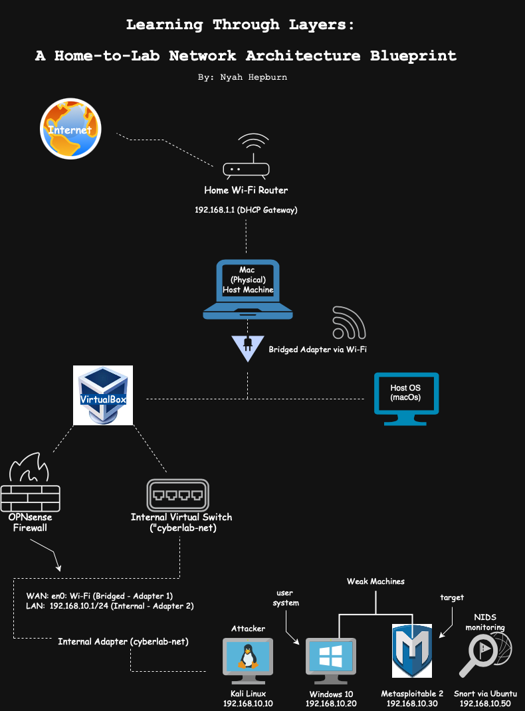

# 🛡️ Infrastructure Security Lab Environment

### Trial By Firewall: Building a Virtual Sandbox for IDS Deployment & Network Defense

**My Role:** Virtualization & Security Lead (Individual Project)

---

## 💡 The Challenge
The objective was to design and deploy a comprehensive, five-VM virtual lab environment capable of simulating a red/blue team scenario to test firewall rules and intrusion detection capabilities. This required overcoming initial hardware incompatibilities and solving complex **virtualization, networking, and IP conflict** issues to ensure controlled traffic segmentation.

## 🛠️ Process & My Technical Contributions

I independently designed and deployed the entire network, focusing on custom defense solutions:

### 1. Virtual Architecture & Firewall Deployment
* **Virtualization:** Designed and deployed the segmented network using **VirtualBox**, featuring a dedicated internal virtual switch (`cyberlab-net`) for all lab machines.
    **

[Image of Network Topology Diagram]
**

* **OPNsense Implementation:** Pivoted from the original plan to **OPNsense** after identifying hardware incompatibilities. I successfully configured the firewall's **WAN and LAN interfaces** to secure the internal network and stabilize the connection between the host and virtual machines.
* **Troubleshooting:** Solved early **IP conflicts** by switching adapter types and reassigning networks, ensuring the attacker (Kali Linux) could only access the lab through the securely configured OPNsense interface.

### 2. Custom IDS Deployment
* **Intrusion Detection System (IDS):** I deployed **Snort 3 via a separate Ubuntu VM** and manually compiled and installed it to monitor all internal network traffic for malicious patterns.
* **Simulation:** Successfully isolated the target (**Metasploitable2**) and used the fully configured network to showcase real-time defense against attack simulations, validating the Snort deployment.

## ✅ Outcome & Impact
This project validated my ability to **design, troubleshoot, and deploy complex, multi-layered security solutions** in a virtual environment. My successful pivot to OPNsense and manual installation of Snort showcased strong **problem-solving skills, flexibility**, and deep technical ownership.

---

### **Technical Stack**
`VirtualBox` • `OPNsense` • `Snort 3` • `Kali Linux` • `Network Segmentation` • `Firewall Configuration`
